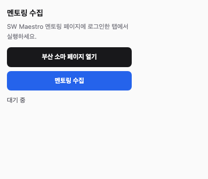

# SW Maestro Busan Mentoring

AI·SW마에스트로 부산 멘토링 일정을 수집하고, 소마 페이지 안에서 일정표/달력/멘토별 보기로 확인하는 Chrome 확장 프로그램입니다.

소마 멘토링 페이지를 매번 열어 신청 상태를 확인하기 번거로워서 만든 도구입니다. 확장 프로그램에서 데이터를 한 번 수집하면, 이후에는 소마 페이지 오른쪽 아래 버튼으로 일정 화면을 바로 열 수 있습니다.

## 할 수 있는 일

- 멘토링 일정과 상세 내용을 한 화면에서 보기
- 신청자 명단을 함께 수집해서 내 신청 완료 일정 표시
- 전체 일정 달력과 내 신청 일정 달력 보기
- 같은 시간에 신청한 일정이 있으면 충돌 경고 표시
- 관심/애매/제외 같은 개인 표시 저장
- 멘토 즐겨찾기와 멘토별 일정 보기
- 수집 결과를 파일로 다운로드하지 않고 확장 프로그램 IndexedDB에 저장

## 설치하기

이 저장소를 내려받습니다.

```bash
git clone https://github.com/Eomhyunjun/busan-soma-mentoring.git
```

Chrome에서 아래 순서로 설치합니다.

1. 주소창에 `chrome://extensions`를 입력합니다.
2. 오른쪽 위 `개발자 모드`를 켭니다.
3. `압축해제된 확장 프로그램을 로드`를 누릅니다.
4. 내려받은 저장소 안의 `extension` 폴더를 선택합니다.

```text
busan-soma-mentoring/extension
```

설치 후 Chrome 툴바의 확장 프로그램 목록에서 `SW Maestro Busan Mentoring`을 고정해두면 수집 버튼을 누르기 편합니다.

## 시작 위치

소마 부산 페이지로 직접 들어가는 것이 가장 헷갈리지 않습니다.

```text
https://www.swmaestro.ai/busan/sw/main/main.do
```


로그인한 상태로 위 페이지에 들어가면, 확장 프로그램이 오른쪽 아래 quick menu 영역에 `멘토링 일정보기` 버튼을 추가합니다.


## 데이터 수집하기

먼저 `https://www.swmaestro.ai/busan/sw/main/main.do`에 로그인되어 있어야 합니다. 로그인 쿠키가 있는 현재 탭에서만 멘토링 목록과 신청자 명단을 읽을 수 있습니다.



1. 소마 부산 페이지를 엽니다.
2. Chrome 툴바에서 확장 아이콘을 누릅니다.
3. 필요하면 `부산 소마 페이지 열기`를 눌러 소마 페이지로 이동합니다.
4. `멘토링 수집` 버튼을 누릅니다.
5. 페이지 오른쪽 아래 진행 상태가 표시됩니다.
6. 수집이 끝나면 확장 프로그램 내부 저장소가 갱신됩니다.

수집 버튼은 파일을 다운로드하지 않습니다. 최신 데이터는 확장 프로그램의 IndexedDB에 저장되고, 일정 화면은 이 데이터를 우선 사용합니다.

## 일정 화면 열기

소마 페이지에 들어가면 오른쪽 아래 quick menu 영역에 `멘토링 일정보기` 버튼이 추가됩니다.

1. `멘토링 일정보기`를 누르면 현재 소마 페이지 위에 일정 화면이 열립니다.
2. 같은 버튼을 다시 누르면 원래 소마 페이지로 돌아갑니다.


좁은 화면에서도 같은 일정 화면을 사용할 수 있습니다.


## 일정 화면 사용법

상단의 탭으로 보는 방식을 바꿀 수 있습니다.

- `내 달력`: 기본 화면입니다. 신청 완료로 감지되었거나 내가 직접 신청 표시한 일정만 봅니다.
- `전체 달력`: 해당 월의 전체 멘토링 일정을 달력으로 봅니다.
- `일정`: 날짜별 목록입니다. 처음에는 모든 날짜가 접혀 있고, `전체 열기` / `전체 닫기`로 한 번에 펼치거나 접을 수 있습니다.
- `멘토`: 멘토 목록과 멘토 상세 일정을 봅니다.
- `내 멘토별`: 내가 신청한 일정을 멘토별로 묶어 봅니다.
- `같이 듣는 사람`: 신청자 명단 기준으로 나와 같은 강의를 듣는 사람을 봅니다.

필터는 현재 탭에서 실제로 동작하는 것만 표시됩니다. 예를 들어 `멘토` 탭에서는 검색만 보이고, `내 달력`에서는 월 이동만 보입니다.

일정 카드의 표시 버튼은 개인 메모용입니다.

- `신청`: 직접 신청한 것으로 표시합니다.
- `관심`: 나중에 다시 볼 일정으로 표시합니다.
- `애매`: 고민 중인 일정으로 표시합니다.
- `제외`: 보지 않을 일정으로 표시합니다.
- `표시한 것만`: 위 상태 중 하나라도 찍어둔 일정만 필터링합니다.

소마 신청자 명단에 내 이름이 `신청완료` 상태로 있으면, 마감된 일정이어도 `신청` 상태가 우선 표시됩니다.

## 충돌과 신청 상태 확인

일정 화면은 수집된 신청자 명단을 기준으로 내 신청 상태를 계산합니다. 소마 페이지에서 로그인한 사용자 이름을 감지하고, 상세 페이지 신청자 명단에 같은 이름이 `신청완료`로 있으면 해당 일정을 신청한 것으로 표시합니다.

신청한 일정끼리 시간이 겹치면 화면 상단에 시간 중복 경고가 표시됩니다. 경고 항목을 누르면 문제가 되는 일정 상세로 바로 이동할 수 있습니다.

일정 카드에도 시간 관련 표시가 붙습니다.

- `충돌`: 내가 신청한 일정끼리 시간이 실제로 겹치는 경우
- `시간 겹침`: 이미 신청한 일정 때문에 같은 시간대에 듣기 어려운 다른 일정
- `다른 회차 신청함`: 같은 멘토/비슷한 제목의 다른 회차를 이미 신청한 경우

같은 날 여러 강의를 신청할 때는 `전체 달력`이나 `내 달력`에서 겹치는 시간을 한 번 더 확인하는 편이 좋습니다.

## 데이터 갱신하기

일정 화면 오른쪽 위의 `데이터 갱신` 버튼을 누르면 현재 소마 탭에서 다시 수집을 시작합니다.

수집이 끝나면:

1. 최신 일정 데이터가 IndexedDB에 저장됩니다.
2. 열려 있던 일정 화면이 새 데이터를 다시 읽고 현재 뷰를 갱신합니다.
3. 새로 추가된 일정, 신청자 상태, 신청 인원 변경이 반영됩니다.

## 업데이트하기

이미 설치한 확장 프로그램을 새 버전으로 바꿀 때는 제거 후 다시 설치할 필요가 없습니다.

1. 저장소 폴더에서 최신 코드를 받습니다.

```bash
git pull
```

2. `chrome://extensions`로 이동합니다.
3. 이 확장 프로그램 카드의 새로고침 버튼을 누릅니다.
4. 열려 있던 소마 페이지를 새로고침합니다.

설치할 때 선택하는 폴더는 저장소 루트가 아니라 `extension` 폴더입니다.

## 파일 구성

- `README.md`: 설치와 사용 설명
- `docs/screenshots/`: README에서 사용하는 스크린샷
- `extension/manifest.json`: Chrome 확장 프로그램 설정
- `extension/content.js`: 소마 페이지에 일정 보기 버튼과 iframe 주입
- `extension/content.css`: 소마 페이지에 붙는 floating 버튼/iframe 스타일
- `extension/background.js`: 수집 스크립트 실행과 IndexedDB 저장 처리
- `extension/collector.js`: 멘토링 목록, 상세, 신청자 명단 수집
- `extension/popup.html`, `extension/popup.js`, `extension/popup.css`: 확장 아이콘을 눌렀을 때 보이는 팝업
- `extension/schedule.html`, `extension/schedule-app.js`: 일정 뷰어 화면

## 참고

- 이 확장은 `https://www.swmaestro.ai/busan/sw/main/main.do`에 로그인된 사용자 세션을 사용합니다.
- 신청자 명단은 상세 페이지 안의 페이지네이션을 따라가며 수집합니다.
- 내 이름은 소마 마이페이지의 로그인 사용자 표시에서 감지하고, 일정 화면 제목에 함께 표시합니다.
- 멘토 정보는 번들 파일을 포함하지 않고, 소마에서 공개한 Notion 멘토 소개 페이지를 런타임에 읽어옵니다.
- 소마 사이트 구조가 바뀌면 수집 로직도 수정이 필요할 수 있습니다.
